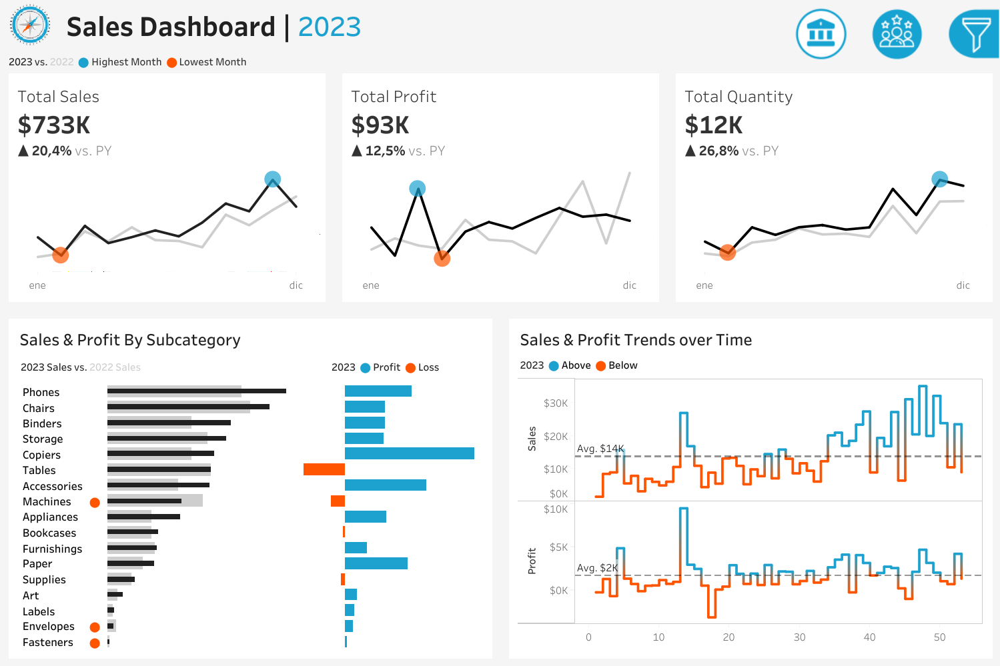
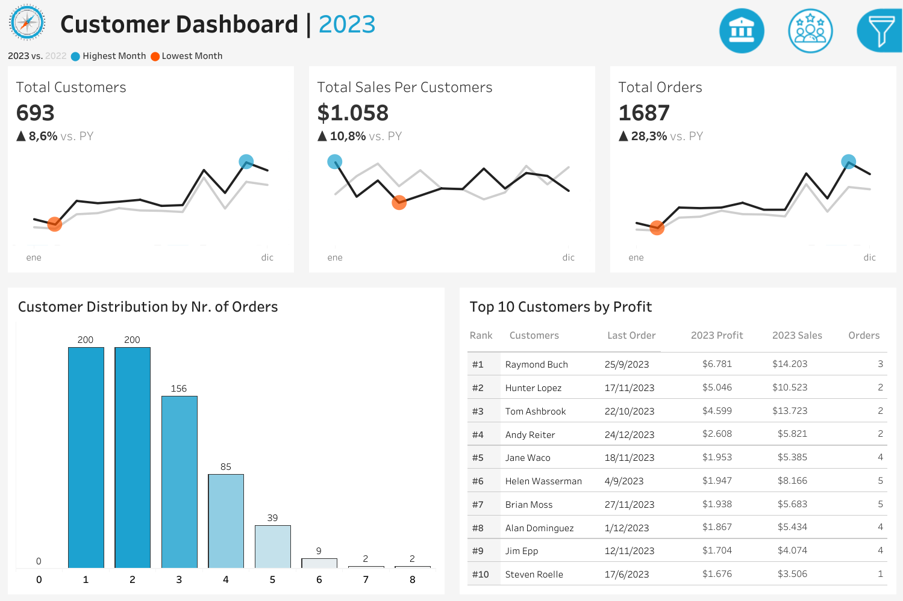

# Retail Sales & Customer Performance Dashboard

Interactive Tableau dashboard suite analyzing retail sales and customer performance, with dynamic year-over-year comparisons.

## Overview

This project delivers two linked, interactive Tableau dashboards — a **Sales Dashboard** and a **Customer Dashboard** — built to give business stakeholders a fast, filterable view of sales performance and customer behavior for a US-based retail business selling Furniture, Office Supplies, and Technology products.

## Business Problem

Stakeholders need a single place to track overall sales, profit, and quantity performance year-over-year, and to understand customer behavior — who the most valuable customers are and how purchase frequency is distributed — without digging through raw transactional data.

## Objectives

- Track headline KPIs (Total Sales, Total Profit, Total Quantity, Total Customers, Total Orders, Sales per Customer) with year-over-year comparison.
- Identify which product sub-categories drive sales and profit, and which are underperforming.
- Understand customer distribution by order frequency and identify top customers by profit.
- Allow drill-down by Category, Sub-Category, Region, and City.

## Dataset

I used the Sample Superstore dataset, a retail dataset covering US orders (2020–2023) across Furniture, Office Supplies, and Technology, split into Customers, Orders, Products, and Location tables.

## Tools & Technologies

- Tableau Desktop / Tableau Public

## Analysis

- Built a relational data model joining Orders, Customers, Products, and Location.
- Created calculated fields for KPIs and year-over-year comparisons, driven by a dynamic Year parameter.
- Designed two container-based dashboards with shared navigation and filters (Category, Sub-Category, Region, City).

## Key KPIs (2023)

**Sales Dashboard**
| KPI | Value | vs. PY |
|---|---|---|
| Total Sales | $733K | +20.4% |
| Total Profit | $93K | +12.5% |
| Total Quantity | 12K units | +26.8% |

**Customer Dashboard**
| KPI | Value | vs. PY |
|---|---|---|
| Total Customers | 693 | +8.6% |
| Total Orders | 1,687 | +28.3% |
| Sales per Customer | $1,058 | +10.8% |

## Dashboard

**Sales Dashboard**


**Customer Dashboard**


🔗 **Live on Tableau Public:** [Sales & Customer Dashboard](https://public.tableau.com/views/SalesCustomerDashboard_17866215257280/SalesDashboard)

## Key Insights

- **Phones, Chairs, and Copiers** are the top sub-categories by 2023 sales; Copiers shows the strongest profit contribution among the leaders.
- **Machines, Envelopes, and Fasteners** are generating losses despite producing sales — a sign of pricing or discounting issues in those sub-categories.
- Purchase frequency is heavily skewed toward occasional buyers: **400 of 693 customers (58%)** placed only 1–2 orders in the year, while just **13 customers** placed 6 or more.
- A small group of customers drives a disproportionate share of profit — the **top 10 customers by profit** are led by Raymond Buch ($6,781 profit on $14,203 in sales across 3 orders).
- Weekly sales trend averages **$14K**, with profit averaging **$2K**, both trending upward through the second half of the year.

## Business Recommendations

- Review pricing/discount strategy for **Machines, Envelopes, and Fasteners** to address negative profit margins.
- Design a retention/loyalty initiative targeting the ~58% of customers with only 1–2 annual orders to increase repeat purchase rate.
- Prioritize account management for the top 10 profit-driving customers to protect and grow that segment.

## Repository Structure

```
retail-sales-customer-dashboards/
├── dashboard/
│   └── Sales & Customer Dashboards.twbx
├── data/
│   ├── Customers.csv
│   ├── Location.csv
│   ├── Orders.csv
│   └── Products.csv
├── images/
│   ├── sales_dashboard.png
│   ├── customer_dashboard.png
│   └── ...
├── LICENSE
└── README.md
```

## Author

**Roger Muñoz** — [LinkedIn](https://www.linkedin.com/in/roger-muñoz-259378375) · [GitHub](https://github.com/RogerMunozTura)
